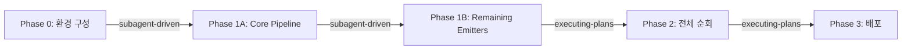
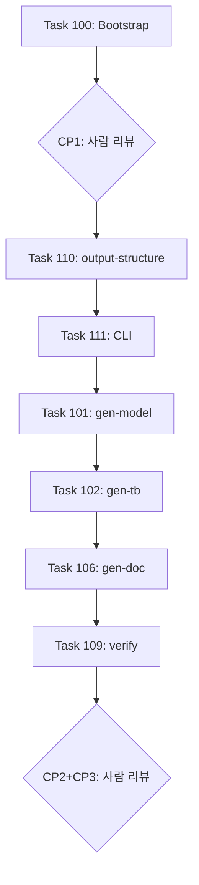

# HIRCT Agent-in-the-Loop 실행 핸드오프

## 현재 상태

- **프로젝트**: HIRCT (HDL IR Compiler and Tools) -- Planning Phase 완료, 구현 코드 0줄
- **워크트리**: `/user/wonseok/.cursor/worktrees/llvm-cpp-model__SSH__fdn00.z_/vgd`
- **Git**: Detached HEAD at `e27b560` (main amend 완료, GAP-D 반영됨)
- **문서**: 45+ 계획 문서 (43 .md), 두 차례 갭 해소 23/23건 완료

---

## 실행 전 잔여 작업 (1건, 약 1초)

### ~~1. GAP-D: SSOT 리다이렉트 스텁 삭제~~ -- DONE (main `e27b560`에 amend 반영)

### 2. Detached HEAD 해소 + 작업 브랜치 생성

```bash
git checkout -b feature/hirct-phase0
```

---

## 실행 방법

### 사용할 스킬




- **Phase 0 / 1A / 1B**: `subagent-driven-development` -- 같은 세션, 태스크별 fresh subagent + 2단계 리뷰
- **Phase 2 / 3**: `executing-plans` -- 별도 세션, 배치 실행 + 체크포인트

### 첫 번째 명령 (Phase 0 착수)

새 세션에서 다음과 같이 시작:

> "subagent-driven-development 스킬로 `docs/plans/phase-0-setup/001-setup-env.md`부터 순차 실행해줘."

---

## Phase 0 태스크 순서


| 순서  | 태스크                    | 문서                                                                            | 예상 시간 |
| --- | ---------------------- | ----------------------------------------------------------------------------- | ----- |
| 1   | 도구 설치 + 환경 검증 + 빌드 인프라 | [001-setup-env.md](docs/plans/phase-0-setup/001-setup-env.md)                 | 1일    |
| 2   | 외부 도구 체인 validation    | [002-tools-validation.md](docs/plans/phase-0-setup/002-tools-validation.md)   | 0.5일  |
| 3   | 코딩 컨벤션 점검              | [003-coding-convention.md](docs/plans/phase-0-setup/003-coding-convention.md) | 0.5일  |


Phase 0 완료 게이트:

- `utils/setup-env.sh` 멱등 실행 성공
- `circt-verilog` LevelGateway.v MLIR 변환 성공
- `verilator --cc` LevelGateway.v 빌드 성공
- `.clang-format` + `make lint` 동작
- `test/lit.cfg.py` + `integration_test/lit.cfg.py` 생성

---

## Phase 1A 배치 구성 + 체크포인트




- **CP1** (Task 100 후): `make build` exit 0 + CMake/디렉토리 설계 리뷰
- **CP2** (Task 101+109 후): verify PASS + lit PASS + gtest PASS + 아키텍처 리뷰
- **CP3** (Task 102+106 후): Phase 1A 완료 게이트 5항목 + Phase 1B/2 진입 판정

---

## 서브에이전트 Brief 템플릿 (각 태스크 시작 시)

태스크 dispatch 시 반드시 포함할 5가지 (`summary.md` Section 4.2):

- **Goal**: 1문장 (무엇이 끝난 상태가 성공인지)
- **Scope**: 수정 허용/금지 경로
- **SSOT**: 참조 문서 목록 (summary, convention, open-decisions, reference-commands + 태스크 문서)
- **Gates**: 실행 명령 + PASS 기준
- **Output**: 최종 답변에 포함할 것 (변경 요약, 커맨드 결과, 리스크/TODO)

---

## SSOT 문서 읽기 순서 (서브에이전트 컨텍스트용)


| 순서  | 문서                                                                                    | 역할                                   |
| --- | ------------------------------------------------------------------------------------- | ------------------------------------ |
| 1   | [summary.md](docs/plans/summary.md)                                                   | 총괄: Phase 로드맵, 체크포인트, 실행 전략          |
| 2   | [hirct-convention.md](docs/plans/hirct-convention.md)                                 | 기술 규약: 검증, 스키마, reason 접두사, XFAIL    |
| 3   | [reference-commands-and-structure.md](docs/plans/reference-commands-and-structure.md) | 목표 구조: 디렉토리, Make 타겟, CLI, meta.json |
| 4   | [open-decisions.md](docs/plans/open-decisions.md)                                     | 의사결정: 26건 전부 RESOLVED                |
| 5   | Phase별 README + 해당 태스크 .md                                                            | 태스크 상세: Step, 코드, 게이트                |


---

## 검증 완료 사항 (이 핸드오프의 근거)

두 갭 해소 계획서 23개 Task 검증 결과:

- **2026-02-16 문서 통합** (12 Task): 전부 반영 완료
- **2026-02-17 갭 해소** (11 Task): 11/11 완료 (GAP-D는 main `e27b560`에 amend 반영)
- **GPT 피드백 5건**: 4건 이미 존재, 1건(escalation) Phase 2 전 선택적 보강
- **writing-plans SKILL**: 6/6 요구사항 충족
- **subagent-driven-development SKILL**: 8/8 요구사항 충족

