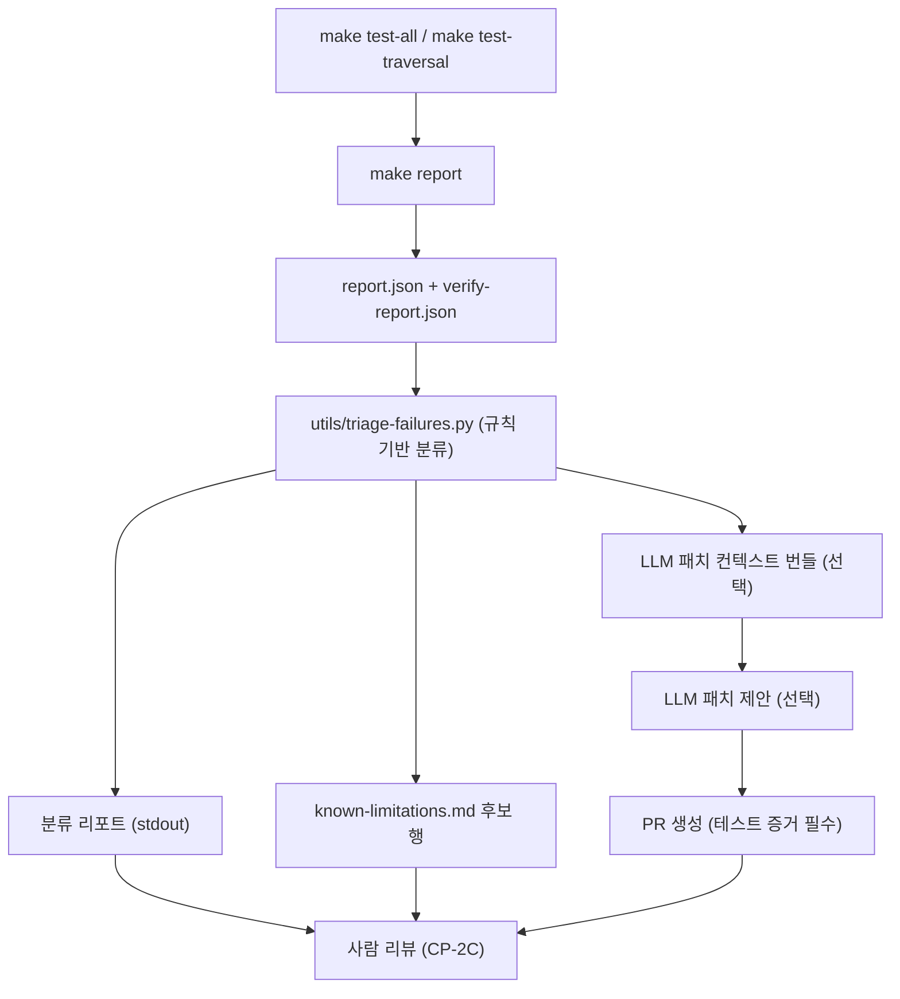

# Task 206: 자동 실패 분류 + LLM 보조 패치 (Agent Triage)

> **목표**: Phase 2 순회 결과를 자동 분류하고, 안전한 범위에서 수정 PR을 생성
> **예상 시간**: 1일
> **Phase**: 2
> **산출물**: `utils/triage-failures.py`, triage 리포트, `known-limitations.md` 후보 행
> **SSOT**: 이 문서가 Agent 권한/금지사항의 **유일한 정의**. 다른 문서는 이 문서를 참조만 한다.

---

## 1. Agent 역할 및 데이터 플로우



**Agent의 두 가지 형태**:

1. **Cursor 서브에이전트**: `subagent-driven-development` 스킬로 코드 수정 실행 (Phase 1 되돌림)
2. **Rule-based triage 도구**: `utils/triage-failures.py` — 실패 자동 분류 + 조치 제안

---

## 2. 분류 규칙 (Rule-Based)

`meta.json`의 `reason` 필드 표준 접두사(`hirct-convention.md` §4.6)를 기반으로 자동 분류:

| 분류 | meta.json 조건 | 자동 조치 |
|------|---------------|----------|
| `parse_error` | `mlir="fail"` + 최상위 `reason` starts with `"parse error:"` | `known-limitations.md`에 등록 |
| `unsupported_op` | `mlir="pass"` + emitter reason starts with `"unsupported op:"` 또는 `unsupported_ops` 필드 존재 | `known-limitations.md` + Phase 1 되돌림 이슈 |
| `multi_module` | `mlir="fail"` + 최상위 `reason` starts with `"multiple modules:"` | `known-limitations.md` (`multi_module`) |
| `flatten_error` | `mlir="fail"` + 최상위 `reason` starts with `"flatten error:"` | `known-limitations.md` (`flatten_error`) |
| `timeout` | 최상위 `reason` starts with `"timeout:"` 또는 `elapsed_ms` > threshold | `known-limitations.md` (`timeout`) |
| `combinational_loop` | `combinational_loop=true` | `known-limitations.md` (`combinational_loop`) |
| `verify_mismatch` | `verify-report.json` result=`"fail"` | 재현 커맨드 생성 + Phase 1 되돌림 |
| `verilator_suspect` | verify mismatch + 모델 검토 후 모델 정상 | Phase 3 교차 검증 대상 등록 |
| `inout_port` | reason starts with `"inout port:"` | `known-limitations.md` (`inout_port`) |
| `multi_clock` | reason starts with `"multi clock:"` | `known-limitations.md` (`multi_clock`) |
| `wide_signal` | reason starts with `"wide signal:"` | `known-limitations.md` (`wide_signal`) |

---

## 3. 자동 PR 권한

### 허용 (자동, 테스트 증거 불필요)

| 대상 파일 | 허용 변경 |
|----------|----------|
| `known-limitations.md` | 행 추가/갱신 (XFAIL 등록) |
| `docs/` 내 문서 | 문서 간 불일치 정리, failure-classification 리포트 |

### 조건부 허용 (테스트 증거 **필수**)

| 대상 파일 | 조건 |
|----------|------|
| `lib/Target/GenModel.cpp` | 단일 op 매핑 추가만, diff **50줄 이하**, `make check-hirct` PASS 증거 첨부 |

### 절대 금지

| 대상 | 사유 |
|------|------|
| `rtl/` 내 모든 파일 | SSOT 위반 — RTL은 원본 불변 |
| `output/` 커밋 | 생성 산출물은 gitignored |
| 다중 파일 동시 수정 | 초기 단계에서 영향 범위 제한 |
| `include/hirct/` 헤더 변경 | API 변경은 사람 리뷰 필수 |

---

## 4. 증거 첨부 필수

PR 생성 시 다음을 **반드시** 포함:

| 항목 | 출처 | 예시 |
|------|------|------|
| 재현 커맨드 | triage 도구 출력 | `hirct-gen rtl/.../foo.v --only model` |
| 모듈 path + top | `meta.json` | `path: "rtl/.../foo.v", top: "FooModule"` |
| 실패 seed/cycle | `verify-report.json` | `seed=42, cycle=347` (verify mismatch 시) |
| stderr tail | `meta.json` `stderr_tail` | 마지막 5줄 |
| 테스트 결과 | make 출력 | `make check-hirct` exit 0 스크린샷/로그 |

---

## 5. 도구: utils/triage-failures.py

### 입력

| 입력 | 경로 | 설명 |
|------|------|------|
| report.json | `output/report.json` | 전체 RTL 순회 결과 |
| verify-report.json | `output/verify-report.json` | 전체 검증 결과 |
| meta.json (다수) | `output/**/meta.json` | per-module 메타데이터 |

### 출력

| 출력 | 형식 | 경로 | 설명 |
|------|------|------|------|
| 분류 요약 | stdout (텍스트) | — | 카테고리별 개수, 대표 모듈 (사람 읽기용) |
| triage 리포트 | JSON | `output/triage-report.json` | 기계 판독 상세 분류 (CP-2C 추적용) |
| known-limitations 후보 | stdout (TSV) | — | `Path\tCategory\tReason\tDate` 형식 |
| PR 대상 파일 목록 | stdout (JSON) | — | `{"files": [...], "reason": "..."}` |

**`output/triage-report.json` 스키마**:

```json
{
  "generated_at": "2026-03-01T10:00:00Z",
  "source": {
    "report": "output/report.json",
    "verify_report": "output/verify-report.json"
  },
  "total_failures": 150,
  "categories": {
    "parse_error": { "count": 80, "top_reasons": ["unknown module (65)", "syntax error (15)"] },
    "unsupported_op": { "count": 30, "top_reasons": ["seq.firmem (25)", "llhd.sig (5)"] },
    "multi_module": { "count": 10 },
    "flatten_error": { "count": 3 },
    "verify_mismatch": { "count": 5, "modules": ["ModuleA", "ModuleB"] },
    "timeout": { "count": 10 },
    "combinational_loop": { "count": 3 },
    "inout_port": { "count": 12 },
    "multi_clock": { "count": 8 },
    "wide_signal": { "count": 2 }
  },
  "known_limitations_candidates": [
    { "path": "rtl/.../foo.v", "category": "parse_error", "reason": "parse error: unknown module 'Bar'" }
  ],
  "phase1_feedback": [
    { "module": "ModuleA", "category": "verify_mismatch", "target_task": "101-gen-model", "seed": 42, "cycle": 347 }
  ]
}
```

### CLI

```bash
python3 utils/triage-failures.py \
    --meta-dir output/ \
    --report output/report.json \
    --verify-report output/verify-report.json \
    --output output/triage-report.json
```

### 에러 처리

- `output/` 미존재 → Error exit 1
- `report.json` 미존재 → 분류 불가, meta.json만으로 부분 분류
- meta.json 파싱 실패 → 해당 모듈을 `infra-error`로 기록

---

## 6. Makefile 타겟

```makefile
# 루트 Makefile에 추가 (Task 205에서 구현)
make triage:
	python3 utils/triage-failures.py \
		--meta-dir output/ \
		--report output/report.json \
		--verify-report output/verify-report.json \
		--output output/triage-report.json
```

**실행 순서**: `make test-all` → `make report` → `make triage`

---

## 게이트 (완료 기준)

- [ ] `utils/triage-failures.py` 존재 + `python3 -m py_compile` 성공
- [ ] 테스트 데이터(임의 meta.json 세트)로 올바른 분류 출력
- [ ] `known-limitations.md` 후보 행이 올바른 형식 (`| Path | Category | Reason | Date |`)
- [ ] `make triage` exit 0
- [ ] 분류 규칙이 §2 테이블과 1:1 대응

---

## 변경 이력

| 날짜 | 내용 |
|------|------|
| 2026-02-16 | 신규 작성: Agent Triage 스펙 (GPT-G1 + Claude-W1 해소) |
